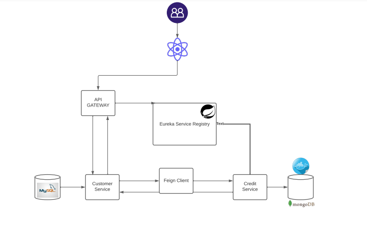
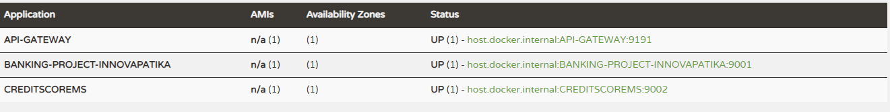
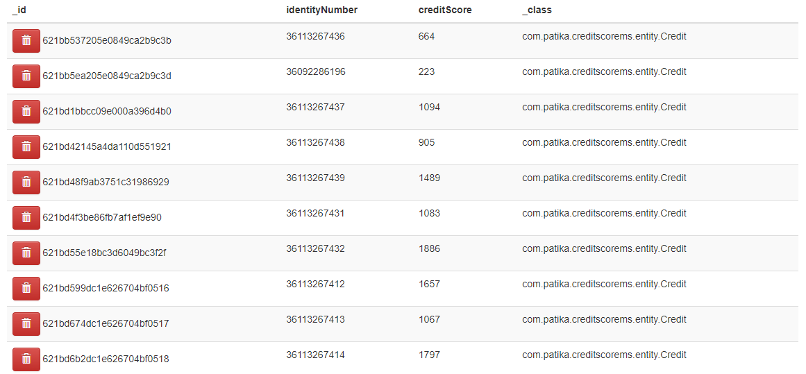
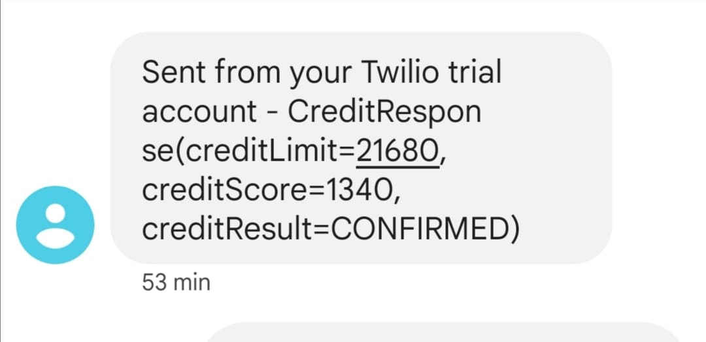

# Innova-Patika Graduation Project

### ATTENTION PLEASE !
## TWILIO AUTH-TOKEN : Twilio API detected that my credentials were compromised and automatically revoked them to protect my account from unauthorized access. So when you send request it will throw an error. (com.twilio.exception.ApiException: Authenticate)
* `Therefore, following the steps below will allow you to send requests without any exception.`
* `InnovaGraduation/creditscorems/src/main/resources/application.properties`
* `Change the value (twilio.password)  with 0ae6a95bb09ed79998c3dddc7a456797 `

## Introduction

Credit inquiry project given as a graduation criteria of java spring bootcamp
which is organized in cooperation of Innova and Patika. This project composed
of two microservices. One of them is Credit inquiry service and the other one
is Customer service. Both of this services with communicate with each other through
Feign Client and also registered with Eureka Service Registry. I used React JS 
in frontend for visual representation of this application.

The purpose of the project is to make a loan application with the name,
surname, identification number and phone number of the customer and learn
the credit limit result. And this result is sent to customer phone via SMS
information. To send a SMS I used Twilio API.

## Technologies and Tools
* Java 11
* Spring Boot
* Eureka Service Registry
* Gateway API
* Mysql
* Mongo Db
* Docker
* Twilio
* React

## Project Structure



## Project Rules

* New users can be defined in the system, existing customers can be updated or deleted.
* If the credit score is below 500, the user is rejected. (Credit result: UNCONFIRMED)
* If the credit score is between 500 points and 1000 points and the monthly income is below 5000 TL, the user's loan application is approved and a limit of 10.000 TL is assigned to the user. (Credit Result: CONFIRM)
* If the credit score is between 500 points and 1000 points and the monthly income is above 5000 TL, the loan application of the user is approved and 20.000 TL limit is assigned to the user. (Credit Result: CONFIRM)
* If the credit score is equal to or above 1000 points, the user is assigned a limit equal to MONTHLY INCOME * CREDIT LIMIT MULTIPLIER. (Credit Result: CONFIRM)
* As a result of the conclusion of the loan, the relevant application is recorded in the database. Afterwards, an informative SMS is sent to the relevant phone number
* A loan application can only be queried with an identification number.
* CREDIT LIMIT MULTIPLIER = 4 (default)

## API Usage

### Customer Service

```http
  http://localhost:9001
```

| HTTP | URL                |
| :--------| :------------------------- |
| `PUT` |  **api/customer/{identity}** |
| `DELETE` |  **api/customer/{identity}** |
| `GET` |  **api/customer** |
| `POST` |  **api/customer** |
| `GET` |  **api/customer/result/{identityNumber}** |

### Credit Service

```http
  http://localhost:9002 
```

| HTTP | URL                       |
| :-------- |  :-------------------------------- |
| `POST`      |  **/api/v1/credit/save** |
| `POST`      |  **/api/v1/credit/request** |

## Eureka


## Mongo Db in Docker


## Check Credit Result With Identity


## Twilio Notification SMS



